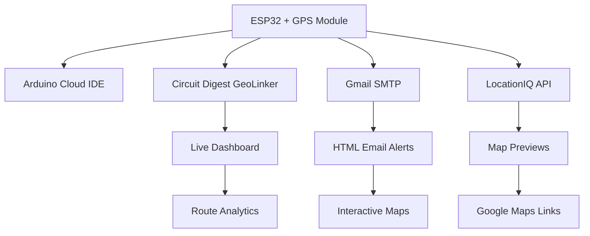

# 🛰️ ESP32 GPS Tracker with Multi-Cloud Integration

[](https://www.arduino.cc/)
[](https://www.espressif.com/)
[](https://en.wikipedia.org/wiki/Global_Positioning_System)
[](https://opensource.org/licenses/MIT)

A **real-time GPS tracking system** built with ESP32 and integrated with multiple cloud platforms for data visualization and notifications.


## ✨ Features

- 🛰️ **Real-time GPS tracking** with TinyGPS++ library
- 📧 **Professional HTML email alerts** with interactive maps
- 📊 **Live dashboard** via Circuit Digest GeoLinker
- 🗺️ **Interactive map previews** using LocationIQ API
- 🔄 **Offline data buffering** - never lose tracking data
- 📱 **Mobile-responsive** email templates
- ⚡ **Auto-reconnection** for WiFi and cloud services
- 💰 **Cost-effective** - Total hardware cost under $30

## 🏗️ Architecture



## 🛠️ Hardware Requirements

| Component | Specification | Approx. Cost |
|-----------|---------------|--------------|
| ESP32 Development Board | Any ESP32 variant | ₹340 |
| GPS Module | NMEA compatible (NEO-6M/8M) | ₹230 |
| Jumper Wires | Male-to-Female | ₹10 |
| Breadboard (Optional) | Half-size | ₹30 |
| **Total** | | **~₹600** |

## 📌 Pin Connections

```
ESP32          GPS Module
GPIO16    -->  TX
GPIO17    -->  RX
3.3V      -->  VCC
GND       -->  GND
```

## 🚀 Quick Start

### 1. Clone Repository
```bash
git clone https://github.com/Prolayjit-B14/GPS_Email_Map.git
cd esp32-gps-tracker
```

### 2. Hardware Setup
- Connect GPS module to ESP32 as per pin diagram above
- Power up the ESP32 via USB

### 3. Configure Credentials
Edit the configuration section in `gps_tracker_alert.ino`:

```cpp
// WiFi Credentials
const char* ssid = "YOUR_WIFI_SSID";
const char* password = "YOUR_WIFI_PASSWORD";

// Gmail SMTP Configuration
#define AUTHOR_EMAIL "your-email@gmail.com"
#define AUTHOR_PASSWORD "your-app-password"  // Use App Password, not regular password

// GeoLinker Configuration
const char* geoApiKey = "YOUR_GEOLINKER_API_KEY";
const char* deviceID = "YOUR_DEVICE_ID";

// LocationIQ API Key (Free tier available)
const String locationIQ_API_KEY = "YOUR_LOCATIONIQ_API_KEY";
```

### 4. Install Required Libraries
In Arduino IDE/Cloud, install these libraries:
- `TinyGPS++` by Mikal Hart
- `ESP Mail Client` by Mobizt
- `GeoLinker` by Circuit Digest
- `WiFi` (ESP32 built-in)

### 5. Upload & Monitor
- Upload code to ESP32
- Open Serial Monitor (115200 baud)
- Watch for GPS lock and first location update!

## 📧 Email Configuration

### Gmail SMTP Setup
1. Enable 2-Factor Authentication on your Gmail account
2. Generate an App Password:
   - Go to Google Account Settings
   - Security → 2-Step Verification → App passwords
   - Generate password for "Mail"
   - Use this password in the code (not your regular password)

### Recipients Configuration
```cpp
const char* emailRecipients[][2] = {
  {"Name 1", "email1@example.com"},
  {"Name 2", "email2@example.com"},
  {"Name 3", "email3@example.com"}
};
```

## 🌐 Cloud Platform Setup

### Circuit Digest GeoLinker
1. Visit [Circuit Digest](https://circuitdigest.com/)
2. Register for GeoLinker service
3. Get your API key and device ID
4. Access live dashboard at [GeoLinker Portal](https://geolinker.org)

### LocationIQ API
1. Sign up at [LocationIQ](https://locationiq.com/)
2. Get free API key (60,000 requests/month)
3. Replace in code for map previews

## 📱 Features Demo

### Email Alert Example
```
📍 GPS Location Update
Time: 2025-07-30 14:30:25 IST
Coordinates: 22.572645, 88.363892
Location: Park Street, Kolkata, West Bengal, India
Satellites: 8 connected
Speed: 0.0 km/h

[Interactive Map Preview]
[View in Google Maps] [Live Dashboard]
```

### Dashboard Features
- 🗺️ Real-time location on interactive map
- 📈 Route history and analytics
- 📊 Speed and distance tracking
- ⏰ Timestamp logs
- 📱 Mobile-responsive interface

## ⚙️ Configuration Options

| Parameter | Default | Description |
|-----------|---------|-------------|
| `GPS_UPDATE_INTERVAL` | 2000ms | GPS reading frequency |
| `LOCATION_SEND_INTERVAL` | 300000ms | Email update interval (5 min) |
| `updateInterval` | 30s | GeoLinker cloud updates |
| `offlineBufferLimit` | 50 | Max offline storage points |

## 🔧 Troubleshooting

### Common Issues

**GPS Not Getting Lock**
- Ensure GPS module is outdoors or near window
- Check wiring connections
- Wait 2-3 minutes for cold start

**WiFi Connection Failed**
- Verify SSID and password
- Check signal strength
- Ensure 2.4GHz network (ESP32 doesn't support 5GHz)

**Email Not Sending**
- Verify Gmail App Password (not regular password)
- Check recipient email addresses
- Ensure internet connectivity

**GeoLinker Not Updating**
- Verify API key and device ID
- Check Circuit Digest service status
- Ensure GPS has valid fix

### Debug Mode
Enable detailed logging:
```cpp
geo.setDebugLevel(DEBUG_VERBOSE);
```

## 📊 Performance Metrics

- ⚡ **GPS Lock Time:** 30-120 seconds (cold start)
- 📡 **Update Frequency:** 30 seconds (cloud), 5 minutes (email)
- 🔋 **Power Consumption:** ~200mA @ 3.3V
- 📶 **WiFi Range:** 50-100 meters (typical)
- 💾 **Memory Usage:** ~60% of ESP32 flash

## 🗂️ Project Structure

```
esp32-gps-tracker/
├── gps_tracker.ino          # Main Arduino sketch
├── README.md                # This file
├── docs/
│   ├── hardware-setup.md    # Detailed hardware guide
│   ├── api-setup.md         # API configuration guide
│   └── troubleshooting.md   # Extended troubleshooting
├── examples/
│   ├── basic-gps.ino        # Simple GPS reading
│   └── email-test.ino       # Email functionality test
└── assets/
    ├── circuit-diagram.png  # Wiring diagram
    └── demo-screenshots/    # UI screenshots
```

## 🔮 Future Enhancements

- [ ] **Mobile app** - Dedicated tracking application
- [ ] **Weather integration** - Location-based weather data
- [ ] **Route optimization** - Shortest path suggestions

## 🤝 Contributing

Contributions are welcome! Please feel free to submit a Pull Request.

1. Fork the repository
2. Create your feature branch (`git checkout -b feature/AmazingFeature`)
3. Commit your changes (`git commit -m 'Add some AmazingFeature'`)
4. Push to the branch (`git push origin feature/AmazingFeature`)
5. Open a Pull Request


## 🙏 Acknowledgments

- **Arduino Community** - For the excellent development platform
- **Circuit Digest** - For GeoLinker cloud visualization service
-   Documentation : https://circuitdigest.com/microcontroller-projects/simple-gps-tracker-using-esp32-visualize-data-on-map
-   Repo : https://github.com/Circuit-Digest/Simple-GPS-Tracker-using-ESP32---Visualize-Data-on-Map/tree/main/GPS_Tracker_Code_V2
- **TinyGPS++ Library** - For robust GPS data parsing
- **LocationIQ** - For cost-effective mapping services
- **ESP32 Community** - For extensive documentation and support

## 📧 Contact

**Your Name** - [@yourhandle](https://twitter.com/yourhandle) - your.email@example.com

Project Link: [https://github.com/yourusername/esp32-gps-tracker](https://github.com/yourusername/esp32-gps-tracker)

---

⭐ **Star this repository if you found it helpful!**

[](https://github.com/yourusername/esp32-gps-tracker)
[](https://github.com/yourusername/esp32-gps-tracker/fork)
